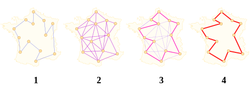

# TSP Solver



Simple library to solve instances of Symmetric [Travelling Salesman Problem](https://en.wikipedia.org/wiki/Travelling_salesman_problem).

Comes in two flavours:

- **src** is a python module
- **walkthrough** is a simple demo-GUI that walks you through solving the problem


## Usage
```python
>>> from src import Solver
>>> s = Solver(algorithm='greedy')
>>> shortest_tour = s.solve(path='a4_.tsp')
>>> shortest_tour
['1', '3', '4', '2']
```

To run **walkthorugh**, download the repository and double-click 
*Solver GUI* icon.


## About
The description of *supported file format* can be found [here](https://wwwproxy.iwr.uni-heidelberg.de/groups/comopt/software/TSPLIB95/tsp95.pdf). 
Implemented approaches are listed below.

**Exact algorithms**

- [Brute force search](https://en.wikipedia.org/wiki/Brute-force_search)
- [Branch and bound algorithm](https://en.wikipedia.org/wiki/Branch_and_bound)
- [Dynamic programming algorithm](https://en.wikipedia.org/wiki/Held%E2%80%93Karp_algorithm)

**Approximation algorithms**

- [Nearest neighbour (greedy) algorithm](https://en.wikipedia.org/wiki/Nearest_neighbour_algorithm)
- [Genetic algorithm](https://en.wikipedia.org/wiki/Genetic_algorithm)


## Dependencies
- [Python](https://www.python.org/downloads/): 3.5.1 or higher
- [pytest](https://docs.pytest.org/en/latest/): 4.5.0 or higher for tests


## Tests
Tests are implemented using `pytest`. To run all tests, please refer to [this piece](https://docs.pytest.org/en/latest/getting-started.html#run-multiple-tests) of *pytest* documentation.


## Documentation


## License
[MIT](LICENSE)
